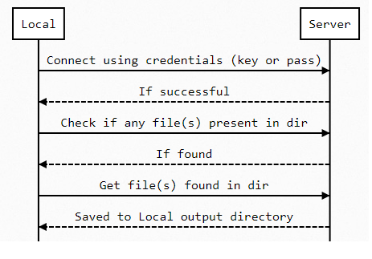

# SFTP File Extractor
The script connects to a sftp server with credentials provided in data.json file and reads the input directory at sftp server and downloads it to a local directory and includes timestamp in the folder name.

## Libraries
pysftp 0.2.9

## Arguements
python simple_sftp_get.py [path/to/data.json]

## Data.json Info
  **ip**:"localhost",                        ---> ip/hostname of the sftp server  
  **port**:"2222",                           ---> port of the sftp server  
  **username**:"root",                       ---> username at sftp server  
  **password**:"mustafa123",                 ---> password of the sftp server  
  **private_key**:"./p.pem",                 ---> path to private_key of the sftp server if you want to use private key remove password arguement and add private key arguement in line 38 of simple_sftp_get.py  
  **input_path**:"/root/test_sftp",          ---> input directory at sftp server  
  **output_path":**./output",                ---> output local directory   
  **output_backup_path**:"./backup"          ---> ignore

